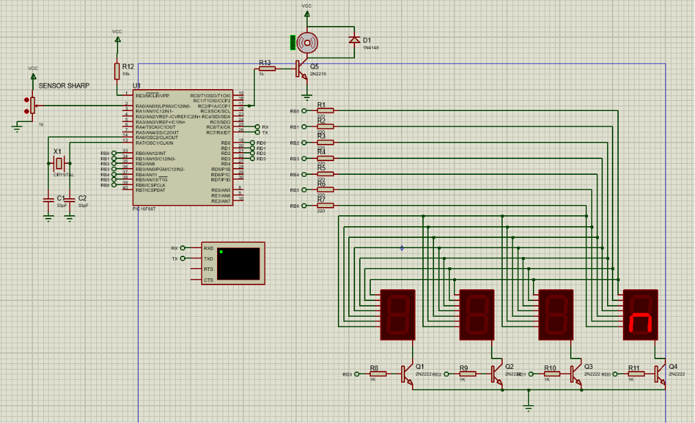
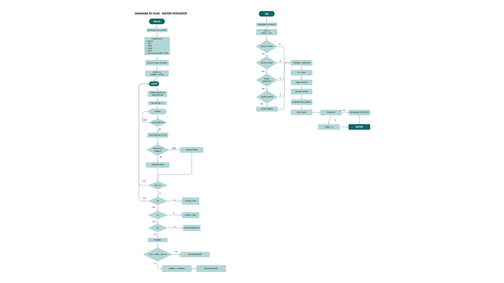

# Bastón inteligente para personas no videntes.
> **Asignatura:** Electrónica Digital II - Universidad Nacional de Córdoba
> * **Integrantes:**
> - GLADES, LUCILA JAZMIN
> - LOSSANI BUFE, GRECIA AZUL
> - SANTESSO, CANDELA
> * **Profesor:** Blasco, Marcos Javier

---

## 1. Descripción General del Proyecto.
Este proyecto consiste en el diseño de un bastón inteligente orientado a asistir en el desplazamiento de personas con discapacidad visual. Su funcionamiento permite detectar la distancia a los obstáculos mediante un sensor infrarrojo Sharp y procesa la información a través de un microcontrolador PIC. Esto se complementa con la comunicación UART, con la que el usuario puede seleccionar una distancia de alerta mediante el modo Casa o Calle, configurar una distancia manual y visualizar la distancia medida. Los displays muestran el modo seleccionado o el valor medido en cada momento.

El objetivo del sistema es brindar una advertencia temprana ante la presencia de obstáculos, mejorando la seguridad durante el desplazamiento de la persona. Cuando la distancia medida es menor a la configurada, el microcontrolador activa una señal de aviso mediante un motor vibrador accionado con PWM, proporcionando al usuario una alerta que facilita una movilidad más segura y autónoma.

### Alcances del Proyecto.
* **El sistema es capaz de:**
  - Medir la distancia a los obstáculos mediante un sensor infrarrojo.
  - Mostrar en displays la distancia medida y el modo de funcionamiento seleccionado.
  - Configurar manualmente la distancia de alerta.
  - Mostrar cuando el usuario seleccione una distancia incorrecta.
  - Permitir seleccionar modo Casa o Calle.
  - Activar una señal de advertencia cuando la distancia al obstáculo es mayor que la configurada.
  - Enviar información del estado del sistema y de la distancia medida por UART.
* **El sistema NO incluye (Fuera de alcance):**
  - Detección del tipo de obstáculo.
  - Reconocimiento de desniveles del terreno.
  - Almacenamiento de datos o historial de mediciones.
  - Brindar conectividad inalámbrica (mediante Wi-Fi o Bluetooth).

### Posibles Etapas Siguientes (Líneas Futuras)

* Reducir el tamaño del circuito integrando los componentes en una única placa, facilitando su incorporación dentro del bastón y mejorando la portabilidad.
* Incorporar una batería recargable y un sistema de bajo consumo para aumentar la autonomía del dispositivo.
* Agregar conectividad Bluetooth o una aplicación móvil para configurar el sistema y monitorear su funcionamiento de forma inalámbrica.
* Incorporar sensores adicionales para mejorar la detección de obstáculos y reducir errores de medición del sensor infrarrojo.
--

## 2. Arquitectura del Sistema: Hardware y Software (Común)

### Hardware & Interconexión
Esta sección presenta la arquitectura de hardware del sistema desarrollado, describiendo los módulos electrónicos que lo componen, la forma en que se interconectan y el flujo de información entre ellos. Además, se incluyen el diagrama de bloques, el esquemático del circuito y las principales consideraciones adoptadas durante el diseño.

 * **Diagrama de Bloques:**
Muestra la estructura general del sistema, identificando los distintos módulos que lo integran y la comunicación existente entre ellos. Su objetivo es brindar una visión global del funcionamiento del hardware sin detallar las conexiones eléctricas específicas. 
* **Esquemático del Circuito:** Circuito esquemático completo del circuito, desarrollado en Proteus 8 Professional, donde se representan las conexiones entre todos los componentes electrónicos que conforman el sistema.
  - **Aclaración:** El sensor Sharp fue reemplazado por un potenciómetro que simule su señal ya que el mismo no se encuentra como parte de la librería de Proteus.
  

* **Descripción del Circuito y Consideraciones de Diseño:**
Circuito compuesto por un microcontrolador PIC que recibe la señal analógica del sensor infrarrojo Sharp a través del conversor ADC, procesa la distancia medida y controla las salidas del sistema. Mediante la comunicación UART se reciben los comandos de configuración enviados desde la computadora, mientras que los displays de siete segmentos muestran el modo de funcionamiento o la distancia configurada.

Como consideraciones de diseño, se utilizaron etapas de adaptación entre los distintos módulos y una etapa de potencia para accionar el motor vibrador mediante PWM. Además, se contempla el uso de un diodo de protección para absorber los picos de tensión generados por la carga inductiva del motor y garantizar un funcionamiento seguro del circuito.

### Arquitectura de Software (Firmware)
* **Diagrama de Flujo o Máquina de Estados:** El siguiente diagrama representa la secuencia de ejecución del programa y el comportamiento general del sistema, mostrando las decisiones y acciones realizadas por el microcontrolador desde la inicialización hasta el funcionamiento continuo del bastón inteligente.


---

## 3. Especificaciones Eléctricas, Alimentación y Entorno (Específico por Asignatura)

### Parámetros de Alimentación y Consumo (Común a ambas materias)
* **Tensión de operación del sistema:** 5 V para PIC; 3,3 V para motor vibrador.
* **Método de alimentación:** Alimentación por USB (5V) para PIC y alimentación por pilas para Motor Vibrador.
* **Consumo estimado o medido:** En modo activo (motor encendido y displays en funcionamiento): aproximadamente 150–250 mA, (dependiendo del consumo del motor y de los displays).
Modo de espera (sin activación del motor): aproximadamente 50–80 mA.
* **Herramientas de Software:** MPLAB X IDE v5.35 y compilador XC8.
* **Hardware de Programación/Depuración:** PICkit 3.
* **Configuración de Bits (Fuses Críticos):**
  * *Oscilador:* HS (Cristal interno de 4MHz)
  * *Watchdog Timer (WDT):* OFF
  * *Master Clear (MCLRE):* OFF 
* **Periféricos Internos Utilizados:** ADC, EUSART (UART), módulo PWM y temporizadores (TMR0 y TMR2).
* **Gestión de Interrupciones:** Se utilizan interrupciones mediante T0IF, para priorizar la multiplexación de los displays mediante desbordamientos del TIMER 0.

---

## 4. Proceso de Integración y Desarrollo.

* **Etapa 1 (Validación inicial):**   Configuración del oscilador del PIC e inicializacion de variables.
* **Etapa 2 (Adquisición/Comunicación):** Implementación del módulo ADC y validación de las mediciones mediante el encendido de LEDs según el valor detectado. 
* **Etapa 3 (Integración lógica):** Desarrollo de la comunicación UART y multiplexación de displays.
* **Etapa 4 (Sistema Completo):** Integración del sensor, acople del motor con PWM, UART y displays para calibración y pruebas finales de funcionamiento. 

---

## 5. Ensayos, Pruebas y Resultados (Común)
Demuestren con datos empíricos que el sistema funciona correctamente. **Es obligatorio incluir registro visual**.

Para comprobar el correcto funcionamiento del bastón inteligente, primero se realizaron pruebas por separado sobre cada uno de los módulos del sistema. Una vez verificado que cada parte funcionaba correctamente, se procedió a integrar todo el firmware y realizar las pruebas finales del proyecto.

### Pruebas funcionales realizadas

**Prueba del conversor ADC:**
Para verificar la lectura analógica del sensor de distancia, se utilizó un potenciómetro conectado al pin AN0 simulando la señal del sensor Sharp. Con el fin de observar fácilmente los cambios en la lectura, se implementó una prueba con LEDs que se iban encendiendo de manera progresiva según el valor de tensión aplicado. Esto permitió confirmar que el módulo ADC estaba realizando correctamente la conversión de la señal y que convertía esos valores en una distancia en centímetros de forma adecuada.

**Prueba del módulo PWM:**
Antes de conectar el motor vibrador, se probó el funcionamiento de la salida PWM utilizando un LED conectado al pin RC2. Al modificar el ciclo de trabajo desde el programa, se observó que la intensidad del LED aumentaba y disminuía de forma gradual, verificando así el correcto funcionamiento del Timer2 y del módulo PWM.

**Prueba de comunicación UART:**
La comunicación serial se ensayó conectando el PIC a una terminal en la computadora configurada a 9600 baudios. Se comprobó que el sistema podía enviar y recibir datos correctamente, sin pérdidas de información, permitiendo ingresar el límite de distancia y visualizar los mensajes de respuesta.

**Prueba de integración del sistema:**
Luego de validar cada módulo individualmente, se integró todo el sistema para verificar su funcionamiento conjunto. Se comprobó que el usuario podía configurar la distancia límite mediante la UART y que dicho valor se mostraba correctamente en los displays multiplexados. Además, al simular que un obstáculo se encontraba por debajo de la distancia configurada, el sistema respondía desactivando la señal PWM y actuando según la lógica programada, retomando su funcionamiento normal cuando el obstáculo se alejaba.

### Evidencia fotográfica y resultados:
Para respaldar las pruebas realizadas, se incluyen imágenes de la terminal serie mostrando la recepción de datos y los mensajes generados por el microcontrolador, fotografías del circuito implementado en protoboard con el PIC16F887 y los displays de siete segmentos, y capturas obtenidas con el osciloscopio donde se observan las señales generadas durante el funcionamiento del sistema.
 * *Capturas de instrumental:* [Insertar capturas de Osciloscopio, Analizador Lógico o Terminal Serie]
  * *Foto del Prototipo Real:* [Insertar foto del hardware final cableado/armado en funcionamiento]
- Capturas de la Terminal Serie (UART): En la siguiente imagen se observa la recepción de datos y los mensajes de respuesta del PIC (LIMITE: XX y ERROR).

- Foto del Prototipo Real: Circuito final montado en protoboard, mostrando el PIC16F887, los displays de 7 segmentos multiplexados y el sistema de comunicaciones.

---

## 📂 6. Estructura del Repositorio

El repositorio mantiene la siguiente estructura limpia, habiendo configurado el archivo `.gitignore` correspondiente para omitir los archivos temporales de compilación:

```text
├── firmware/          # Proyecto de MPLAB X y código fuente
│   ├── src/           # Archivos de código fuente (.asm)
│   └── inc/           # Archivos de cabecera e inclusión (.inc)
├── hardware/          # Archivos de diseño, esquemáticos en PDF/Imagen y diagramas
├── docs/              # Datasheets clave del microcontrolador y componentes
└── README.md          # Este archivo de presentación e informe técnico
